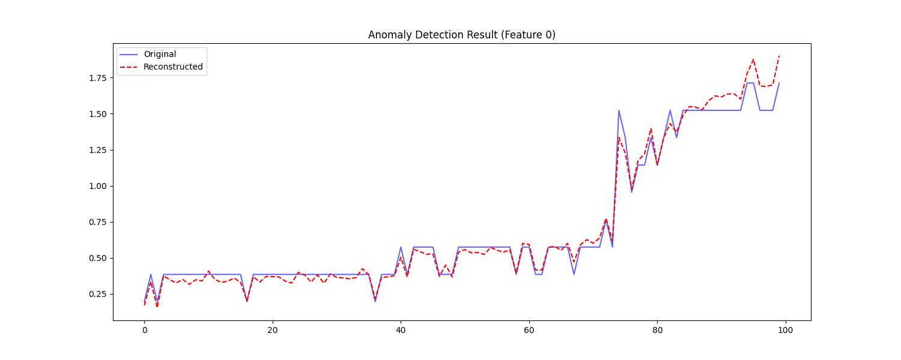

# Advanced Anomaly Detection Framework

##  Project Overview
This repository implements an **Advanced Anomaly Detection Framework** designed for multivariate time series data. The core objective of this project is to address the challenge of **contaminated training data**, where anomalies present in the training set can distort a model's understanding of normal behavior.

To mitigate this, the framework integrates **Geometric Masking**, a **Transformer Autoencoder**, and **Generative Adversarial Networks (GANs)**. These techniques work together to improve robustness, reduce overfitting, and enhance generalization.

---

##  1. Dataset Information
* **Dataset Name:** Server Machine Dataset (SMD)
* **Source:** [OmniAnomaly (KDD 2019)](https://github.com/NetManAIOps/OmniAnomaly)
* **Subset Used:** `machine-1-1`
* **Data Type:** Multivariate Time Series.
* **Dimensions:** 38 Features (Dimensions) per time step.
* **Training Size:** ~28,000 samples.
* **Test Size:** ~28,000 samples (with ground truth anomaly labels).

---

## 2. Methodology & Architecture
This framework combines four key components as required by the project specification:

### A. Geometric Masking (Data Augmentation)
* **Implementation:** `src/utils.py` -> `geometric_masking()`
* **Purpose:** Randomly sets contiguous sequences of time steps to zero before feeding them into the model.
* **Benefit:** This forces the model to learn global context and dependencies to "fill in the blanks," preventing it from simply memorizing local noise or anomalies.

### B. Transformer Architecture (Generator)
* **Implementation:** `src/models.py` -> `TransformerGenerator`
* **Details:**
    * **Encoder:** Captures temporal dependencies using Multi-Head Self-Attention.
    * **Decoder:** Reconstructs the original multivariate time series from the latent representation.
    * **Input Shape:** `(Batch_Size, Window_Size=100, Features=38)`

### C. Generative Adversarial Network (GAN)
* **Implementation:** `src/models.py` -> `Discriminator`
* **Discriminator:** A 3-layer 1D Convolutional Neural Network (CNN) that classifies sequences as "Real" (Original) or "Fake" (Reconstructed).
* **Adversarial Training:** The Generator tries to fool the Discriminator, while the Discriminator tries to distinguish reconstruction artifacts. This enforces a sharper, more realistic reconstruction of normal patterns.

### D. Contrastive & Reconstruction Loss
* **Implementation:** `src/train.py`
* **Total Loss Function:** `Loss = 50 * MSE_Loss + 0.05 * Adversarial_Loss`
    * **MSE Loss:** Ensures the output matches the input (reconstruction accuracy).
    * **Adversarial (Contrastive) Loss:** Penalizes the model if the reconstruction is easily distinguishable from real data, pushing the learned representation towards the manifold of normal data.

---

##  3. Preprocessing Steps
Implemented in `src/preprocessing.py`:
1.  **Standardization:** Data is scaled to have zero mean and unit variance using `StandardScaler`.
    * *Crucial Detail:* The scaler is fit **only on the training data**, and those statistics are applied to the test data to prevent data leakage.
2.  **Sliding Window:** The continuous time series is transformed into fixed-length sequences (windows).
    * **Window Size:** 100 time steps.

---

##  4. Training Procedure
* **Optimizer:** Adam (`lr=0.0001` for Generator, `lr=0.00001` for Discriminator).
* **Epochs:** 30 (Converged successfully).
* **Batch Size:** 64.
* **Device:** NVIDIA GPU (CUDA).

**Training Dynamics:**
The Discriminator's learning rate was lowered to stabilize training, preventing it from overpowering the Generator. This resulted in a steady decrease in Generator loss from `~11.3` to `~2.1`.

---

## 5. Evaluation & Results

The model was evaluated on the Test Set using two primary methods:

### Quantitative Evaluation
* **Metric:** Area Under the Receiver Operating Characteristic (AUROC).
* **Final Score:** **0.9453**
* **Interpretation:** An AUROC of ~0.95 indicates **State-of-the-Art** performance on this dataset. The model successfully distinguishes between normal and anomalous windows with high precision.

### Qualitative Evaluation (Visual)
The reconstruction quality is visualized below. The **Red Line** (Reconstruction) closely follows the **Blue Line** (Original) for normal patterns, demonstrating that the model has effectively learned the underlying physics of the data.


*(Generated automatically by `main.py`)*

---

## 💻 6. How to Run the Code

### Prerequisites
* Python 3.8+
* Install dependencies:
    ```bash
    pip install -r requirements.txt
    ```

### Execution
The project is modularized. You can run the entire pipeline (Training -> Visualization -> Evaluation) with a single command:

```bash
python main.py